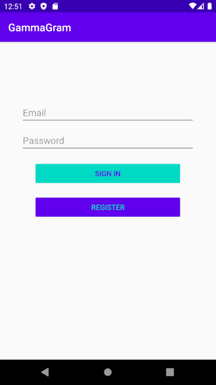

# Project 3 - *GammaGram*

**GammaGram** is a photo sharing app similar to Instagram but using Parse as its backend.

Time spent: **10+10** hours spent in total

## User Stories

The following **required** functionality is completed:

- [ ] User can view the last 20 posts submitted to "Instagram".
- [ ] The user should switch between different tabs - viewing all posts (feed view), compose (capture photos form camera) and profile tabs (posts made) using fragments and a Bottom Navigation View. (2 points)
- [ ] User can pull to refresh the last 20 posts submitted to "Instagram".

The following **optional** features are implemented:

- [ ] User sees app icon in home screen and styled bottom navigation view
- [ ] Style the feed to look like the real Instagram feed.
- [ ] User can load more posts once he or she reaches the bottom of the feed using infinite scrolling.
- [ ] Show the username and creation time for each post.
- [ ] User can tap a post to view post details, including timestamp and caption.
- [ ] User Profiles
      - [ ] Allow the logged in user to add a profile photo
      - [ ] Display the profile photo with each post
      - [ ] Tapping on a post's username or profile photo goes to that user's profile page and shows a grid view of the user's posts 
- [ ] User can comment on a post and see all comments for each post in the post details screen.
- [ ] User can like a post and see number of likes for each post in the post details screen.

The following **additional** features are implemented:

- [x] Checks for valid email address and sets initial username to the email substring before '@.'
- [x] Regex to check that password contains a capital letter, lowercase letter, and number. Password also must be at least 8 characters long.
- [x] Implemented email verification system with Parse

## Video Walkthrough

Here's a walkthrough of implemented user stories:

GIF created with [ShareX](https://getsharex.com/).

## Notes

The Android emulator seems to have issues initializing the ACTION_IMAGE_CAPTURE intent (it actually works with the camera but curiously does not pass the (intent.resolveActivity(getPackageManager()) != null) check. It passes this check on my device, but to use it on emulator I had to just start the activity without the null pointer check.

## Open-source libraries used

- [Android Async HTTP](https://github.com/codepath/CPAsyncHttpClient) - Simple asynchronous HTTP requests with JSON parsing
- [Glide](https://github.com/bumptech/glide) - Image loading and caching library for Android

## License

    Copyright 2020 Nicolas LaGamma

    Licensed under the Apache License, Version 2.0 (the "License");
    you may not use this file except in compliance with the License.
    You may obtain a copy of the License at

        http://www.apache.org/licenses/LICENSE-2.0

    Unless required by applicable law or agreed to in writing, software
    distributed under the License is distributed on an "AS IS" BASIS,
    WITHOUT WARRANTIES OR CONDITIONS OF ANY KIND, either express or implied.
    See the License for the specific language governing permissions and
    limitations under the License.
    
